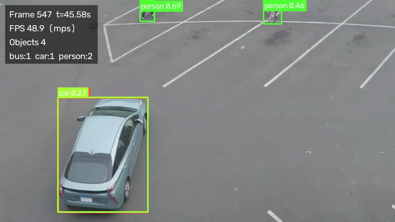

# SmartCity Vision

Turns traffic-camera video into structured traffic analytics with YOLOv8 and OpenCV.

The project is being built in phases, and the goal is a system that behaves like production
infrastructure rather than a detection demo: typed configuration, a video-source abstraction that
treats files, webcams, and RTSP streams identically, measured performance instead of estimated
performance, and tests that assert behaviour rather than existence.

**Status: Phase 1 of 12 complete** — configuration, video ingestion, YOLOv8 detection, overlay
rendering, an annotated-video writer, and a measured run summary. Tracking, counting, zone/line
analytics, persistence, the API, and the MLOps layers land in later phases (see
[Roadmap](#roadmap)).

Every number in this README was produced by running the code on this machine. Nothing is estimated.



## Quickstart

Requires Python 3.11 or newer.

```bash
git clone https://github.com/Dorianbansoodeb/smartcity-vision.git
cd smartcity-vision

python3 -m venv .venv
source .venv/bin/activate          # Windows: .venv\Scripts\activate
pip install -e ".[dev]"            # or: pip install -r requirements.txt

# Fetch a public sample clip (people, bicycles, and cars in a car park).
curl -L -o data/input/traffic.mp4 \
  https://raw.githubusercontent.com/intel-iot-devkit/sample-videos/master/person-bicycle-car-detection.mp4

python scripts/run_video.py --input data/input/traffic.mp4
```

The first run downloads `yolov8n.pt` (6.2 MB) and caches it at `models/yolov8n.pt`, so later runs
work offline. Outputs land in `data/output/`:

| File | Contents |
| --- | --- |
| `annotated_video.mp4` | Source video with boxes, labels, confidences, and a status panel |
| `run_summary.json` | Measured statistics plus the full config snapshot for that run |

## Measured Phase 1 performance

Clip: 647 frames, 768×432, 12 fps (54 s of footage).
Hardware: Apple M3 (8 cores), macOS 26.5.1, Python 3.13.14, torch 2.13.0, ultralytics 8.4.135,
OpenCV 5.0.0, weights `yolov8n.pt` at `imgsz=640`, `conf=0.25`, `iou=0.45`.
Method: 3 repeats per device, video writing disabled so both devices do identical work
(`--device {mps,cpu} --no-video`). Median across repeats, with the observed range in brackets.

| Device | Avg inference | p95 inference | End-to-end throughput | Wall clock | Detections |
| --- | --- | --- | --- | --- | --- |
| MPS (what `auto` picks here) | 16.93 ms [16.57–18.04] | 25.22 ms [23.65–26.30] | 55.34 fps [51.87–56.59] | 11.69 s [11.43–12.47] | 369 |
| CPU | 22.32 ms [22.04–22.59] | 25.65 ms [25.21–26.28] | 43.74 fps [43.18–44.28] | 14.79 s [14.61–14.98] | 369 |

Reading these honestly: MPS is about 24% faster than CPU on mean inference, but the two are within
noise of each other at the p95, and MPS is the more variable of the two. On this clip and this
model size the tail latency is not improved by the accelerator, which is the number that would
matter for a real-time deployment. That is a result worth knowing before optimising the wrong thing,
not a result to hide.

All six runs produced identical detection counts (369 total: 210 person, 86 car, 64 bicycle,
5 motorcycle, 3 bus, 1 truck), the sanity check that device selection is not changing results.
Throughput on both devices exceeds the clip's 12 fps source rate, so this clip processes faster than
real time on a laptop. A single full run that also writes the annotated video took 13.38 s at
48.36 fps on MPS, so encoding costs a few frames per second.

Latency is measured after an explicit warmup inference, because the first forward pass on MPS took
742–1425 ms across four measured runs — roughly 45–85× the steady-state median. Charging that to the
first real frame inflated the reported average enough to push it above the p95, which is exactly how
misleading benchmark numbers get published. `model.warmup` controls this.

An ONNX Runtime comparison against these PyTorch baselines is Phase 11; no ONNX numbers are claimed
yet.

## Command line

`scripts/run_video.py`, `scripts/run_webcam.py`, and `python -m smartcity_vision` share one
implementation in `src/smartcity_vision/cli.py`. The scripts work from a source checkout without
installing; `python -m smartcity_vision` and the `smartcity-vision` console script require
`pip install -e .`.

```bash
python scripts/run_video.py --input data/input/traffic.mp4      # file
python scripts/run_webcam.py --display                          # webcam 0 with a preview window
python scripts/run_video.py --input rtsp://camera.local/stream1  # network stream
python -m smartcity_vision --input data/input/traffic.mp4 --device cpu
```

Useful flags: `--device {auto,cpu,cuda,mps}`, `--conf`, `--iou`, `--imgsz`, `--frame-skip`,
`--max-frames`, `--loop`, `--display`, `--output-dir`, `--no-video`, `--log-level`, and
`--set key=value` for any config key without a dedicated flag:

```bash
python scripts/run_video.py --frame-skip 2 --max-frames 100 \
  --set visualization.show_confidence=false
```

## Configuration

All tunables live in [`config/default.yaml`](config/default.yaml) and are validated by Pydantic
models in `src/smartcity_vision/utils/config.py`. Precedence is defaults → YAML → `--set`
overrides → explicit CLI flags.

Validation is strict on purpose: unknown keys are rejected rather than ignored (a typo like
`confidenc_threshold` fails loudly instead of silently doing nothing), thresholds are range-checked,
and `image_size` must be a multiple of the YOLOv8 stride of 32 so it cannot be silently rounded.
Config sections are added as the phase that consumes them lands, so the file never contains options
that no code reads.

`AppConfig.snapshot()` produces the JSON config snapshot embedded in every `run_summary.json`. That
snapshot is the seed of the audit trail that Phase 5 turns into a `model_predictions_audit` table.

## Layout

```
config/default.yaml              Validated configuration
scripts/run_video.py             CLI entry points (thin wrappers over cli.py)
scripts/run_webcam.py
src/smartcity_vision/
├── cli.py                       Argument parsing and run orchestration
├── exceptions.py                Package error hierarchy
├── detection/detector.py        YoloDetector, Detection, DetectionResult, device resolution
├── video/source.py              VideoSource abstraction: file, webcam, stream + factory
├── video/processor.py           Frame pipeline and ProcessingStats
├── visualization/renderer.py    Boxes, labels, status panel
└── utils/{config,logging}.py    Typed config and logging setup
tests/                           63 behavioural tests
```

Three boundaries matter for later phases. The video source yields plain `Frame` objects, so nothing
downstream knows whether frames came from a file or an RTSP camera. The detector converts
Ultralytics results into `Detection` objects immediately, so no other module depends on the
Ultralytics API — which is what makes the Phase 11 ONNX swap a contained change. `VideoProcessor` is
the only place that knows the order of operations, so tracking and analytics plug in there rather
than into the detector or the renderer.

## Testing

```bash
pytest          # 63 tests, ~1.5 s, no weights or GPU required
ruff check .
ruff format --check .
```

The tests assert behaviour, not the existence of functions. Decoded frames are checked for correct
order, content, and frame-rate-derived timestamps against a video generated in a fixture; the source
factory is checked for dispatching webcam indices, URL schemes, and paths correctly, and for failing
loudly on a missing file; detection conversion, class-name-to-id filtering, single model load across
frames, and error wrapping are tested against a stubbed Ultralytics model, so the suite needs no
weights and no GPU; frame skipping, frame limits, warmup exclusion, and non-mutation of the decoded
frame are tested end to end through the real pipeline with a stub detector; and the renderer is
checked at the pixel level, including that a box outline is drawn without filling its interior and
that a label on a box at the top-left corner stays inside the frame.

## Design notes

**Device selection.** `auto` prefers CUDA, then Apple Silicon MPS, then CPU. An explicit request for
unavailable hardware logs a warning and falls back to CPU rather than crashing part-way through a
run.

**Weights handling.** A missing local weights file is treated as a request for the equivalently
named official checkpoint, downloaded straight to the configured path so it stays inside the project
rather than landing in the working directory, and so subsequent runs are offline and reproducible.

**Frame skipping.** `--frame-skip N` drops N frames between processed frames, and the annotated
output's frame rate is divided by the same stride so playback duration still matches the source.

**Timestamps.** File sources derive timestamps from the frame index and frame rate, which is
deterministic and reproducible. Live sources use a monotonic clock, because a stream has no
meaningful "frame N of M".

**Fail fast.** The video source is constructed before model weights are loaded, so a typo in a path
or an unreachable stream fails in milliseconds instead of after a multi-second model load.

**Interruption.** `Ctrl-C` finalises the video writer, writes the summary for the frames already
processed, and exits 130, instead of leaving a corrupt output file. A handled configuration or video
error exits 1 with a single readable message rather than a traceback.

## Known limitations after Phase 1

- **No tracking yet.** Detections are per-frame and have no identity across frames, so the counts in
  `run_summary.json` are detection totals, not unique-object counts. Unique counting arrives in
  Phase 2, and the numbers above should not be read as "369 vehicles and people".
- **Pretrained COCO weights, unvalidated on this domain.** No precision, recall, or mAP is reported
  here because none has been measured; the sample clip has no ground-truth labels. The frame shown
  above includes a visible failure mode — one car is also detected as a bus by `yolov8n`.
- **Conditions not evaluated.** Low light, rain, heavy occlusion, and unusual camera angles are
  untested. `MODEL_CARD.md` (Phase 12) will document this properly.
- **Numbers above are single-run and single-machine.** They are honest measurements from one run on
  one Apple M3, not a benchmark averaged over repeats, and CPU figures on this machine reflect a
  laptop under a desktop session.
- **No privacy layer yet.** The annotated video currently persists identifiable pixels. Face and
  licence-plate anonymisation is Phase 7 and will default to on.
- **`mp4v` codec** is used for output because it is available in stock OpenCV wheels; it is not the
  most efficient choice and is configurable via `output.video_codec`.
- **Preview windows** need a desktop session; `--display` degrades to headless with a warning when
  no window can be opened.

## Roadmap

| Phase | Scope | Status |
| --- | --- | --- |
| 1 | Config, video ingestion, YOLOv8 detection, rendering, measured runs | Complete |
| 2 | ByteTrack/BoT-SORT tracking, unique vehicle counting | Next |
| 3 | Line crossing, polygon zones, trajectories, geometry tests | Planned |
| 4 | Density, congestion classification, queue length, speed estimation | Planned |
| 5 | SQLite persistence, pandas analytics, `model_predictions_audit` table | Planned |
| 6 | FastAPI backend with Prometheus metrics endpoint | Planned |
| 7 | Privacy/anonymisation layer (on by default) | Planned |
| 8 | MLflow experiment tracking, champion/challenger comparison | Planned |
| 9 | Class-distribution drift detection | Planned |
| 10 | Docker, docker-compose (app + Prometheus + Grafana), GitHub Actions CI | Planned |
| 11 | ONNX export and PyTorch vs ONNX Runtime latency benchmark | Planned |
| 12 | README polish, `MODEL_CARD.md`, `training/` docs, profiling | Planned |

## Attribution

Sample clip: [`person-bicycle-car-detection.mp4`](https://github.com/intel-iot-devkit/sample-videos)
from Intel's IoT DevKit sample videos. Detection model: [Ultralytics
YOLOv8](https://github.com/ultralytics/ultralytics) (`yolov8n.pt`, AGPL-3.0 — note that Ultralytics'
licence terms apply to any deployment of this project that uses their weights).
