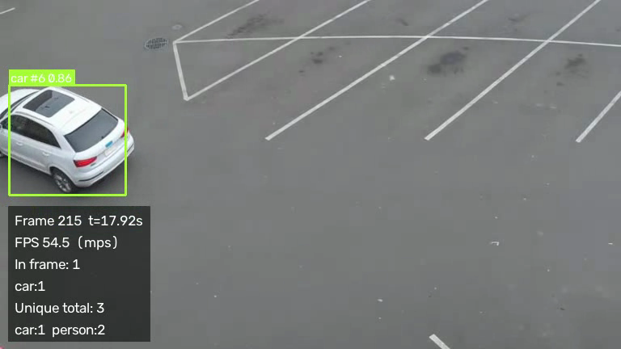

# SmartCity Vision

Turns traffic-camera video into structured traffic analytics with YOLOv8 and OpenCV,
then treats the result like a regulated production system: every run is persisted
with a model hash and a config snapshot, frames are anonymised before they hit
disk, class-mix drift is scored, and inference latency is scraped in Prometheus
text format.

**Status: Phases 1–12 complete.** Every number below was produced by running the
code on this machine. Nothing is estimated. Precision, recall, and mAP are **not
reported** because the sample clip has no ground-truth labels.

**Live demo:** [dorian-smartcity-vision.fly.dev](https://dorian-smartcity-vision.fly.dev)
runs YOLOv8 on the sample clip when you click Analyze. GitHub Pages is a static
replay only.



## Quickstart

Requires Python 3.11 or newer.

```bash
python3 -m venv .venv
source .venv/bin/activate
pip install -e ".[dev]"

curl -L -o data/input/traffic.mp4 \
  https://raw.githubusercontent.com/intel-iot-devkit/sample-videos/master/person-bicycle-car-detection.mp4

python scripts/run_video.py --input data/input/traffic.mp4
```

The first run downloads `yolov8n.pt` (6.2 MB) into `models/`. Outputs land in
`data/output/`:

| File | Contents |
| --- | --- |
| `annotated_video.mp4` | Boxes, track IDs, trajectories, lines, zones, HUD |
| `run_summary.json` | Measured stats + the full config snapshot |
| `smartcity.db` | Detections, events, metrics, `model_predictions_audit` |
| `events.csv` / `traffic_metrics.csv` / `summary.json` | Pandas export of that run |

```bash
pytest                    # 150 tests, ~2 s, no GPU required
ruff check . && ruff format --check .
python -m uvicorn smartcity_vision.api.app:app --reload   # API + /docs
python scripts/benchmark_onnx.py                          # PyTorch vs ONNX, real numbers
```

## What the sample clip actually produced

Clip: 647 frames, 768×432, 12 fps. Weights: `yolov8n.pt`. Tracker: ByteTrack.

| Quantity | Measured value |
| --- | --- |
| Detections | 344 |
| Unique objects | 10 (2 bicycle, 3 car, 5 person) from 11 tracks; 1 discarded as too short-lived |
| Line crossings | 3, all `lot_midline`, all `A->B` |
| Zone events | 13 enter, 13 exit (`parking_lot`) |
| Peak congestion | LOW |
| Mean estimated speed | 81.5 px/s (uncalibrated — not km/h) |
| Persist | run `d7ba019b5f8d4dcba13fc1d5ffa3bb8f`, 344 detection rows, 647 metric rows |

Unique counts are *reproducible*, not *validated*. Continuity of track IDs on this
clip was 0.98 mean (max span 68 frames). See Phase 2 notes below.

## Measured performance

Absolute latency on a fanless laptop drifts with thermal state. Compare **within**
a batch; ranges sit next to medians.

Hardware: Apple M3, macOS 26.5.1, Python 3.13.14, torch 2.13.0, ultralytics 8.4.135,
OpenCV 5.0.0.

**Device comparison** (detection only, 3 repeats):

| Device | Avg inference | p95 | Throughput |
| --- | --- | --- | --- |
| MPS | 16.93 ms [16.57–18.04] | 25.22 ms | 55.34 fps |
| CPU | 22.32 ms [22.04–22.59] | 25.65 ms | 43.74 fps |

**Tracker comparison** (MPS, interleaved):

| Configuration | Avg inference | Throughput | Unique |
| --- | --- | --- | --- |
| Detection only | 18.85 ms | 49.45 fps | n/a |
| ByteTrack | 19.65 ms | 47.15 fps | 10 |
| BoT-SORT | 20.96 ms | 44.70 fps | 10 |

Tracking costs ~1–2 ms/frame here. Both trackers produced the same unique counts.

**ONNX vs PyTorch** (`scripts/benchmark_onnx.py`, 30 frames after 5 warmup, CPU,
`imgsz=640`):

| Runtime | Avg | p95 | min | max |
| --- | --- | --- | --- | --- |
| PyTorch | 29.72 ms | 55.37 ms | 22.59 ms | 126.33 ms |
| ONNX Runtime 1.29.0 | 39.74 ms | 43.93 ms | 36.65 ms | 51.89 ms |

ONNX was **slower on the mean** (0.75×) and **tighter on the tail**. That is the
honest answer to "how would you cut latency": export, measure, and notice that
mean and p95 can move in opposite directions. A production call would then
profile the Ultralytics ORT wrapper vs a slim custom runtime, not assume ONNX
is faster.

Latency is measured after warmup. The first MPS forward pass took 742–1425 ms
across four runs (~45–85× steady state).

## Architecture

```
src/smartcity_vision/
├── detection/     YoloDetector, YoloTracker (ByteTrack / BoT-SORT)
├── video/         source abstraction + VideoProcessor
├── analytics/     count, lines, zones, trajectories, density, queue, speed
├── privacy/       face/plate redaction (on by default, before disk write)
├── monitoring/    Prometheus instruments + class-mix drift
├── database/      SQLite + model_predictions_audit
├── reports/       pandas summary + CSV/JSON export
├── api/           FastAPI, Pydantic, /metrics/prometheus
├── visualization/ overlays from config, no hardcoded coordinates
└── experiments.py MLflow logging + champion/challenger report
```

Four boundaries keep later changes local:

1. A `Frame` does not know if it came from a file, a webcam, or RTSP.
2. Ultralytics results become `Detection` objects at the edge.
3. `YoloTracker` subclasses `YoloDetector` and overrides one method.
4. `VideoProcessor` is the only place that knows the order of operations.

## Privacy

`privacy.enabled` defaults to **true**. Annotated video is redacted before it is
written. OpenCV 5 wheels on this machine do not ship Haar cascades, so the
anonymiser falls back to geometry: the top of each person box and the bottom of
each vehicle box. That is a real pixel change (the tests assert it) and a
deliberately conservative stand-in, not a production PII detector. See
`MODEL_CARD.md`.

Public camera footage of people is exactly the data GDPR/PIPEDA-style rules
exist for. The control is on by default so a forgotten flag cannot leak a face
into `data/output/`.

## Monitoring and drift

`GET /metrics/prometheus` exposes inference latency, request count, per-class
detections, and completed-run counts.

`DriftDetector` compares the class mix in a rolling window against a stored
baseline using total variation distance. An injected all-person window against
an 80/20 car/person baseline scores TV = 0.80 and is flagged. In production
this is the check Prometheus Alertmanager would page on; this repo does not
build the pager.

## API

```bash
python -m uvicorn smartcity_vision.api.app:app --reload
```

| Method | Path | Purpose |
| --- | --- | --- |
| GET | `/health` | Liveness |
| GET | `/metrics` | Latest-run summary |
| GET | `/metrics/prometheus` | Prometheus text |
| GET | `/vehicles/counts` | Unique counts |
| GET | `/traffic/current` | Last metric row |
| GET | `/traffic/history` | Full metric series |
| GET | `/crossings` | Line crossings |
| GET | `/zones/events` | Zone enter/exit |
| POST | `/analyze/video` | Run the pipeline |
| GET | `/reports/summary` | Pandas summary |
| GET | `/reports/export` | Rewrite CSV/JSON |

Interactive docs: `/docs`.

## Configuration

Everything lives in [`config/default.yaml`](config/default.yaml) and is validated
by Pydantic. Unknown keys are rejected. Current sections: `model`, `tracking`,
`analytics` (counting, lines, zones, trajectories, density, queue, speed),
`video`, `output`, `visualization`, `privacy`, `monitoring`, `logging`.

Lines and zones are pixel coordinates for the 768×432 sample clip. Retune per
camera — nothing in the code hardcodes them.

## Testing

```bash
pytest          # 150 tests
ruff check .
ruff format --check .
```

Tests assert behaviour: a 50-frame track counts once; walking past the end of a
line is not a crossing; a vanished-inside-zone track is closed as an exit;
history length is capped; congestion thresholds are inclusive of the lower
bound; injected distribution shift is flagged; redaction changes interior
pixels and leaves the exterior alone; `/crossings` is 404 when no run exists
rather than inventing an empty success.

## Docker and CI

```bash
docker compose up --build
```

brings up the API (`:8000`), Prometheus (`:9090`), and Grafana (`:3000`).
Grafana is provisioned against Prometheus; the dashboard is a starting point,
not a claim that it has been used in an incident.

GitHub Actions (`.github/workflows/ci.yml`) runs pytest, ruff, and a Docker
build on every push/PR.

The public live demo is `Dockerfile.demo` on Fly.io (`fly.toml`, region `yyz`).
It serves `/`, runs one analysis at a time, and transcodes the OpenCV writer
output to H.264 so the browser can play it. The machine auto-stops when idle.

```bash
fly deploy
```

### Deploying this to Cloud Run / GKE (config only)

A Cloud Run service would wrap the same `uvicorn` image, mount a volume (or
GCS fuse) for `data/` and `models/`, and point Prometheus at
`/metrics/prometheus`. GKE would add an HPA on that latency histogram and a
dedicated node pool if you move inference to a GPU. The Fly live demo is the
deployment that has actually been stood up from this repository.

## Custom training

See [`training/README.md`](training/README.md) and [`MODEL_CARD.md`](MODEL_CARD.md).
The future class list (`emergency_vehicle`, `accident`, …) is a template.
Those classes have not been trained.

## Known limitations

- No precision / recall / mAP — the clip is unlabelled.
- Peak congestion LOW is correct for this clip (rarely more than one vehicle).
- Speed and queue length are pixel-space unless you set `metres_per_pixel`.
- Haar cascades are missing from the OpenCV 5 wheel used here; fallback regions
  are used instead.
- Identity is not guaranteed across full occlusion.
- ONNX was not faster on the mean in the measured CPU run.
- Single-machine numbers; treat cross-batch comparisons as meaningless.

## Attribution

Sample clip: [Intel IoT DevKit sample videos](https://github.com/intel-iot-devkit/sample-videos).
Detection model: [Ultralytics YOLOv8](https://github.com/ultralytics/ultralytics)
(`yolov8n.pt`, AGPL-3.0).
